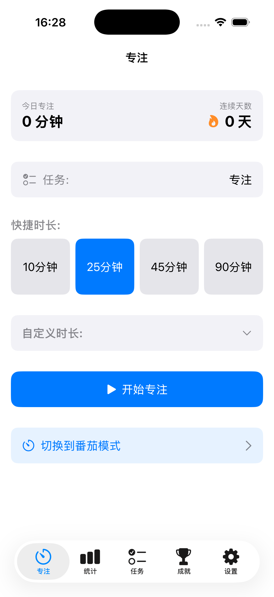
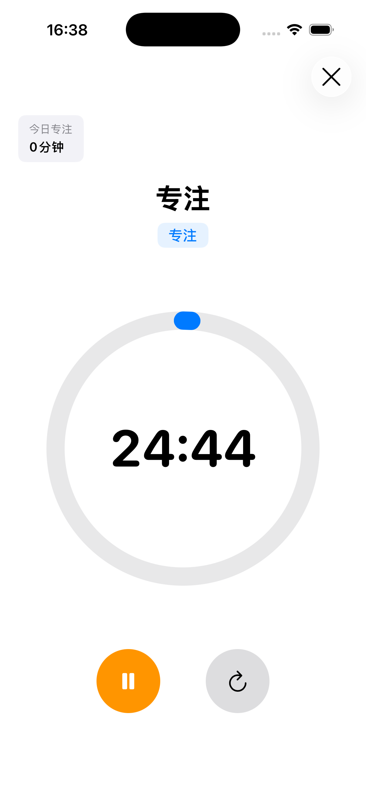
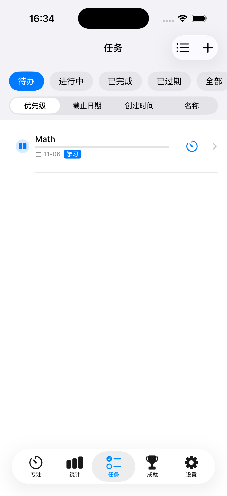
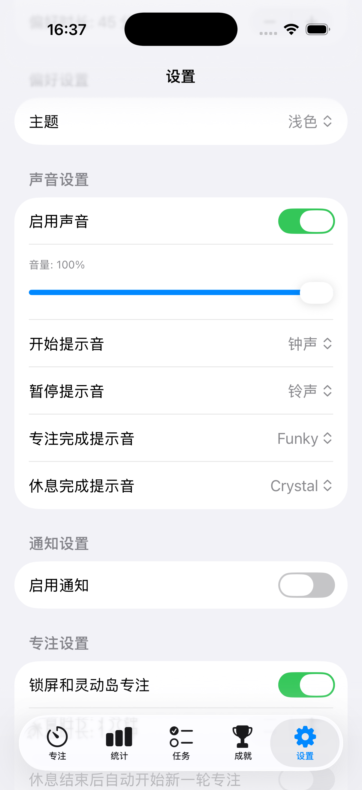
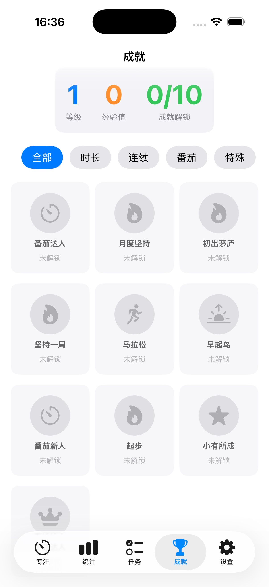
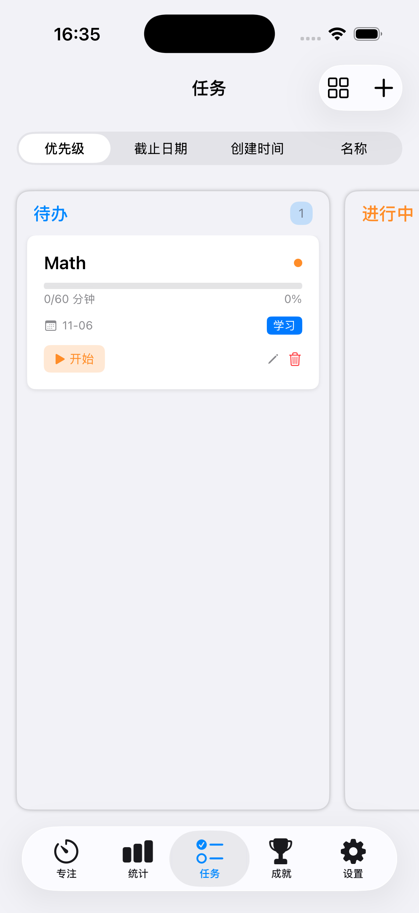

---
## 🧭 项目名称

**FocusFlow —— 智能专注与效率系统**

> 一款跨平台的学习 / 工作专注管理工具，整合计时、统计、同步与个性化激励系统，帮助用户以更科学的方式建立深度专注习惯。

---

## 🎯 一、项目总体目标

实现一个在 **iOS、iPadOS、macOS** 上原生运行、数据无缝同步的专注管理工具，使用 SwiftUI 构建，支持多种专注模式（普通计时、番茄模式、自定义模式），并提供可视化统计、激励机制和 iCloud 云端同步功能。
### 1.1 核心价值主张
* 帮助用户建立科学的专注习惯，提升工作学习效率
* 通过数据可视化让用户直观了解时间使用情况
* 跨设备无缝同步，随时随地保持专注状态
* 游戏化激励机制，让专注变得有趣且可持续

### 1.2 目标用户群体
* 学生群体：需要专注学习，准备考试
* 职场人士：需要深度工作，提升生产力
* 自由职业者：需要自律管理时间
* 知识工作者：需要长时间专注思考

---

## 🌍 二、Apple 生态技术方案

### 2.1 前端技术栈
* **主框架**：SwiftUI 5.0+
* **状态管理**：@State, @StateObject, @ObservableObject, @EnvironmentObject
* **并发处理**：Swift Concurrency (async/await, Actor)
* **本地数据库**：SwiftData / Core Data
* **图表库**：Swift Charts
* **动画库**：SwiftUI Animations + Lottie-ios

### 2.2 后端与云服务
* **云同步方案**：
  - 主推：iCloud (CloudKit + CloudKit Sync)
  - 备选：Firebase (Firestore + Authentication + Cloud Storage)
* **数据加密**：AES-256 端到端加密
* **CDN**：静态资源（音频、图片）使用 iCloud Drive / Firebase Storage

### 2.3 平台适配
* **iOS**：支持 iOS 17.0+
* **macOS**：支持 macOS 14.0+ (Sonoma)
* **iPadOS**：支持 iPadOS 17.0+
* **watchOS**：支持 watchOS 10.0+（可选）
* **响应式设计**：使用 SwiftUI 的自适应布局系统，支持多设备尺寸

---

  <table>
    <tr>
      <td align="center">
        
      </td>
      <td align="center">
        
      </td>
      <td align="center">
        
      </td>
    </tr>
    <tr>
      <td align="center">
        
      </td>
      <td align="center">
        
      </td>
      <td align="center">
        
      </td>
    </tr>
  </table>

---